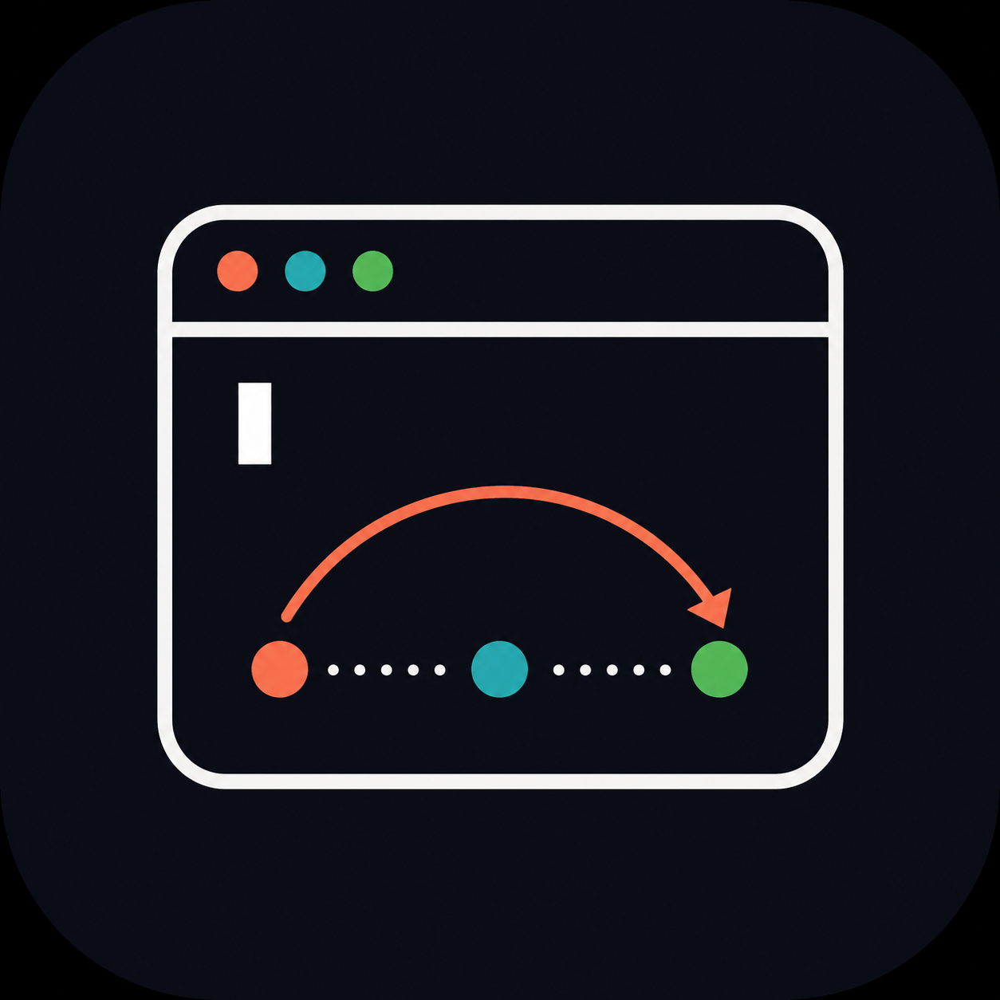
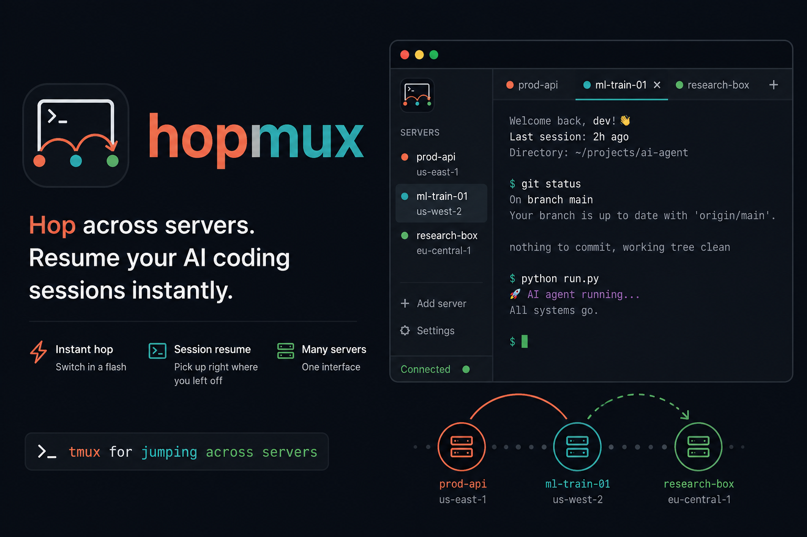

<div align="center">



# hopmux

**Hop across your SSH servers and resume any Claude Code or Codex session — instantly.**

*tmux for jumping across servers.*



</div>

---

## What is it

You run work across a handful of machines — a lab workstation, a couple of GPU boxes, whatever's in your `~/.ssh/config`. On each one you've got several **Claude Code** or **Codex** sessions going: one debugging a dataloader, one refactoring a model, one you started three days ago and half-forgot.

Getting back to any single one means: remember which server → `ssh` in → hunt through `tmux` or `claude --resume`'s list → squint at the titles → hope you picked the right one. Times five servers. Every day.

**hopmux collapses that to two clicks.** It reads your SSH config, connects to every host at once, and shows every session waiting on each — with the working directory it lives in, so an opaque title still tells you *which* thing. Pick one, and you're in — on the right host, in the right directory, in the right conversation.

## Who it's for

- You **SSH into more than one or two machines** and lose track of what's running where.
- You use **Claude Code and/or [Codex CLI](https://github.com/openai/codex)** and run **several sessions in parallel**.
- You live in `tmux` and want a **fast index over all of it**, across hosts.
- Researchers, ML/CV grad students, anyone juggling many remote experiments.

## Features

- **One window over every host in `~/.ssh/config`.** Reachable hosts light up; unreachable/needs-login ones are marked with the reason.
- **Finds your AI sessions automatically** — scans `~/.claude/projects` (Claude Code) and `~/.codex/sessions` (Codex) on each host, newest first, each with its **resume path** and first prompt.
- **Tabbed terminals** — open several sessions at once, switch between them, split with real `tmux` (`Ctrl-B %`).
- **Live tmux sessions** listed too, with attached state.
- **Start new sessions** — launch a fresh claude / codex / shell in any remote directory, with shell-style **Tab-completion** for the path.
- **Filter sessions** — by agent kind (claude/codex/tmux), title, or directory subtree.
- **One-click SSH key install** — for password-only hosts: log in once in the app, click 🔑, and that host never asks again.
- **GPU at a glance** — toggle to see each host's GPU utilization (great for "which box is free?").
- **Native desktop app** (macOS, Windows via Wails) — its own window, its own terminal, not bound to your shell — *and* a **standalone terminal TUI**.
- **Dark & light**, keyboard-driven, colored (Claude coral, Codex cyan, tmux green).
- **Connection-safe** — probes over one reused SSH connection per host (`ControlMaster`); never re-hammers a host that failed auth.

## Install

### Download

**→ [Latest release](https://github.com/sumin1ee/hopmux/releases/latest)** — download and run, no build step.

- **macOS** — download `hopmux.dmg`, open it, and drag **hopmux** to Applications.
  The app is unsigned, so on first launch **right-click it → Open** (or run
  `xattr -dr com.apple.quarantine /Applications/hopmux.app`).
- **Windows** — download `hopmux-amd64-installer.exe` and run it. It installs
  hopmux with a Start-menu entry and an uninstaller.

That's it — launch hopmux and it reads your `~/.ssh/config`.

### Requirements (on the remote hosts)

For full functionality each host needs `python3` (for session discovery) and
`tmux`. `claude` / `codex` must be installed there for resume to launch.

## Usage

**→ Full guide: [docs/USAGE.md](docs/USAGE.md)** (browsing, tabs, tmux splits, GPU view, login, settings).

Quick version: pick a server on the left → its sessions appear → click one to open it as a tab.

| | |
|---|---|
| Open a session | click it (opens a tab) |
| Split the terminal | `Ctrl-B %` / `Ctrl-B "` (real tmux) |
| Close a tab | `⌘W` or the tab's ✕ |
| Toggle sidebar | `⌘B` |
| Toggle GPU view | `⌘G` |
| Dark / light | `⌘D` |
| Rescan | `⌘R` |
| Zoom in / out | `⌘+` / `⌘-` / `⌘0` |
| Add a server / edit config | sidebar → **Add server** / **Settings** |

## How it works

hopmux isn't a terminal emulator in the traditional sense — it's a controller. It reads `~/.ssh/config`, probes every host concurrently over a reused SSH connection, and inventories each host's `tmux` sessions plus Claude Code / Codex sessions (by scanning their session files). Opening a session hands a terminal to `ssh -t <host> tmux …`, so panes, splits, and persistence come from battle-tested `tmux`. The desktop app hosts that terminal in its own native window (via [Wails](https://wails.io) + [xterm.js](https://xtermjs.org)).

```
┌── ~/.ssh/config ──┐   concurrent, connection-safe    ┌── on each host ──┐
│ ml-train-01       │  ───────────────────────────▶   │ tmux ls          │
│ prod-api          │   (one reused ControlMaster/host)│ ~/.claude/projects│
│ research-box …    │  ◀───────────────────────────   │ ~/.codex/sessions │
└───────────────────┘         session inventory        └──────────────────┘
```

## Project layout

```
core/        reusable engine — ssh config, discovery/probe, tmux command builders, models
internal/ui/ the terminal TUI (Bubble Tea)
desktop/     the native desktop app (Wails: Go backend + xterm.js frontend)
main.go      the CLI / TUI entry point
```

## Status

Early but usable. The desktop app runs natively on both macOS and Windows. Contributions welcome.

## License

hopmux is released under the **MIT License** — see [LICENSE](LICENSE).

It bundles the [D2Coding](https://github.com/naver/d2codingfont) font (© NAVER
Corp., **SIL Open Font License 1.1**) and depends on Wails, xterm.js, Bubble Tea,
and others. Full attributions are in [THIRD_PARTY_LICENSES.md](THIRD_PARTY_LICENSES.md).
