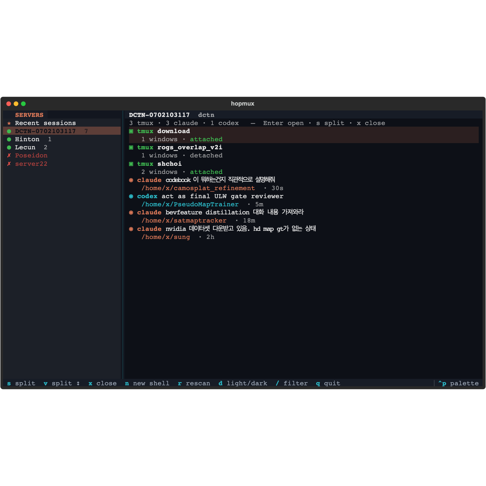
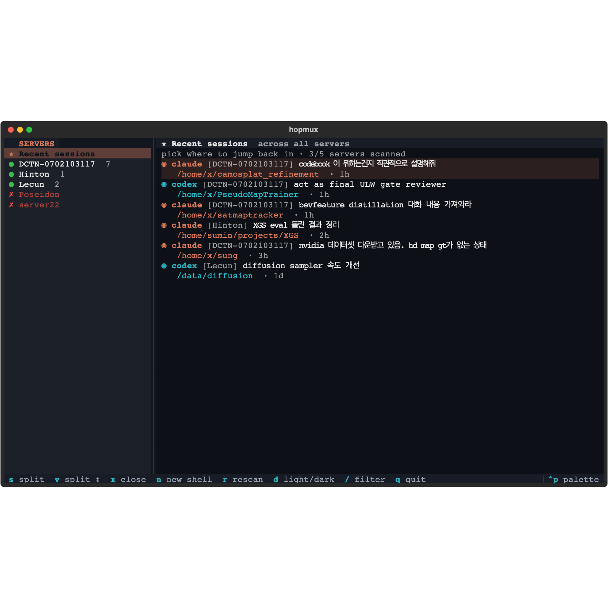
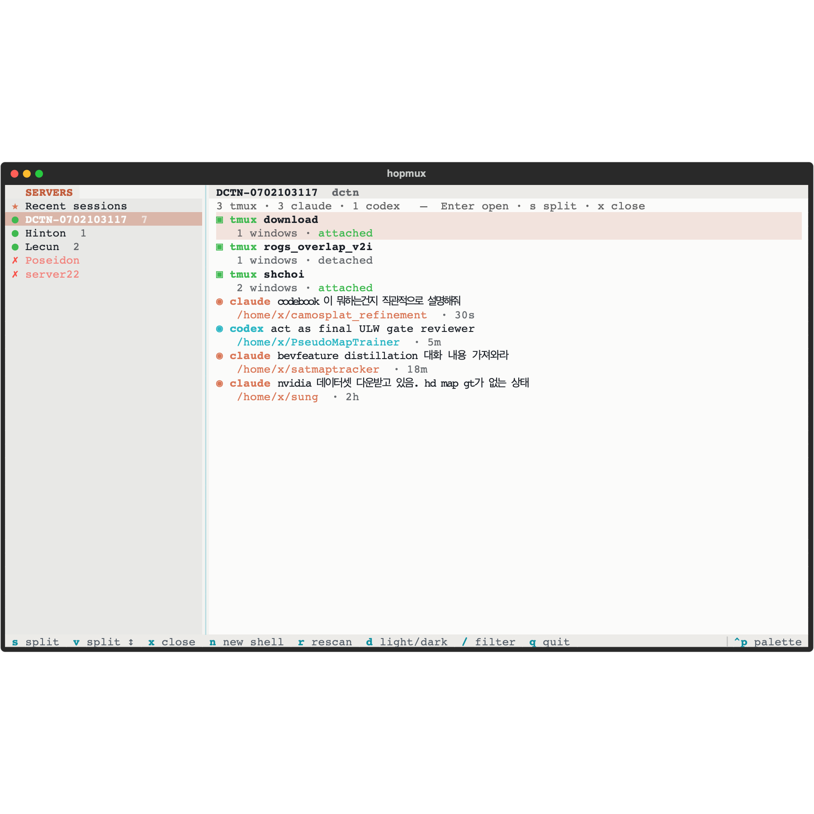

<div align="center">

# hopmux

**Hop across your SSH servers and pick up any Claude Code or Codex session exactly where you left off.**

A cmux-style terminal dashboard: your servers on the left, their live `tmux` panes and resumable AI-agent sessions on the right. One keypress drops you back in — on the right host, in the right directory, in the right conversation.



</div>

---

## The problem

You run experiments across a handful of machines — the lab workstation, a couple of GPU boxes, whatever's in your `~/.ssh/config`. On each one you've got several Claude Code or Codex sessions going at once: one debugging a dataloader, one refactoring a model, one you started three days ago and half-forgot.

Getting back to any single one means: remember which server it was on → `ssh` in → find the tmux session or dig through `claude --resume`'s list → squint at the titles → hope you picked the right one. Times five servers. Every day.

**hopmux collapses that to two keypresses.** It reads your SSH config, connects to every host at once, and shows you every session waiting on each — with the working directory it lives in, so an opaque title like *"fix the thing"* still tells you *which* thing. Pick one, hit Enter, you're in.

## Who it's for

- You **SSH into more than one or two machines** and lose track of what's running where.
- You use **Claude Code and/or [Codex CLI](https://github.com/openai/codex)** and run **several sessions in parallel**.
- You live in `tmux` and want a **fast index over all of it**, across hosts, without a heavyweight IDE.
- Researchers, ML/CV grad students, anyone juggling many remote experiments at once.

If you only ever touch one server, plain `tmux` is enough — you don't need this.

## What it does

- **One dashboard over every host in `~/.ssh/config`.** Reachable hosts light up green with a session count; unreachable ones are dimmed with the reason.
- **Finds your AI sessions automatically.** Scans `~/.claude/projects` (Claude Code) and `~/.codex/sessions` (Codex) on each host and lists them newest-first, each with its **resume path** and first real prompt as a title.
- **Lists live `tmux` sessions** too, showing which are attached.
- **"Recent" landing view.** With nothing selected, hopmux shows the most recently touched sessions *across all servers* — so the very first thing you see is "here's where to jump back in."
- **Open / split / close with terminal-standard keys.** Enter attaches; `s`/`v` split the pane and drop a chosen session into it; `x` closes. Splits and persistence are real `tmux` underneath.
- **Dark & light themes**, and it's colored — Claude sessions coral, Codex cyan, tmux green — never a wall of white text.
- **Fast.** Hosts are probed concurrently over one reused SSH connection each (`ControlMaster`), so a dozen servers scan in the time one handshake takes.

<div align="center">

| Recent view — jump back in across all servers | Light theme |
|:---:|:---:|
|  |  |

</div>

## How it works

hopmux is **not** an embedded terminal emulator. It's a controller: it owns the sidebar, the session index and the layout intent, and it drives **`tmux` on the remote host** for the actual terminals. When you open or split a session, hopmux hands your real terminal to `ssh -t <host> tmux …` — so you get true panes, resizing and persistence from battle-tested `tmux`, and the exact same behaviour on macOS and Windows.

```
┌── ~/.ssh/config ──┐        concurrent SSH probe          ┌── on each host ──┐
│ DCTN   Hinton     │  ───────────────────────────────▶   │ tmux ls          │
│ Lecun  Poseidon   │   (one reused ControlMaster/host)    │ ~/.claude/projects │
└───────────────────┘  ◀───────────────────────────────   │ ~/.codex/sessions │
        │                     TSV inventory                └──────────────────┘
        ▼
   hopmux TUI  ──Enter──▶  ssh -t host 'tmux new-session -A -s hopmux …'
                          └▶ or: cd <cwd> && claude --resume <id>
```

## Install

hopmux needs **Python 3.8+** on your machine, and `python3` + `tmux` on the remote hosts you want full functionality on.

```bash
pip install hopmux          # once published to PyPI
# or, from source:
git clone https://github.com/isumin/hopmux
cd hopmux && pip install .
```

Then just:

```bash
hopmux
```

<details>
<summary>Requirements in detail</summary>

- **Local:** Python ≥ 3.8, the OpenSSH client (`ssh`). The TUI dependency is [Textual](https://github.com/Textualize/textual); `pip` pulls it in.
- **Remote (per host):** `python3` for session discovery, and `tmux` for open/split/attach. A host missing `python3` still shows its `tmux` sessions; a host missing `tmux` can still be reached with a plain shell.
- **`claude` / `codex`** must be installed on the remote for resume to actually launch there (hopmux lists the sessions regardless).
- **Windows:** works as a client (identical UI via Textual). SSH connection multiplexing is skipped since Windows OpenSSH lacks `ControlMaster`; everything else is the same.

</details>

## Usage

Launch `hopmux` and:

| Key | Action |
|-----|--------|
| `↑` / `↓` | move within a panel |
| `→` / `Enter` (on a server) | jump into that server's session list |
| `←` | back to the server list |
| `Enter` (on a session) | **open** — attach to the tmux session, or resume the Claude/Codex session in its directory |
| `s` | **split** the pane side-by-side and run the selected session in it |
| `v` | split **stacked** (vertical) |
| `x` | **close** the current hopmux pane |
| `n` | open a fresh shell on the selected server |
| `/` | filter the session list (by title, path, agent) |
| `r` | rescan all servers |
| `d` | toggle **dark / light** |
| `q` | quit |

The left panel's **★ Recent sessions** entry (selected on launch) shows the most recent sessions across every server.

### Command line

```bash
hopmux                     # the interactive dashboard
hopmux --list              # print the inventory as text and exit
hopmux --only DCTN,Hinton  # restrict to specific hosts
hopmux --local             # also include this machine as a host named "local"
hopmux --timeout 8         # per-host SSH connect timeout in seconds (default 6)
hopmux --config PATH       # use a non-default ssh config
```

`--list` is handy in scripts or just to eyeball what's running:

```
● DCTN-0702103117   tmux:4 claude:15 codex:15
    ▣ tmux  download               1w attached
    ◉ claude camosplat_refinement  codebook 이 뭐하는건지 설명해줘
    ◉ codex  PseudoMapTrainer       act as final ULW gate reviewer
● Hinton             tmux:0 claude:2 codex:19
    ...
  ✗ Poseidon         (Permission denied (publickey))
```

## Notes & limitations

- **Discovery is read-only and safe.** hopmux only *reads* `tmux ls` and the session metadata files; it never modifies your history. It probes with `BatchMode=yes`, so a host that needs a password never hangs the dashboard — it just shows as unreachable (you can still `Enter` to connect interactively).
- **Titles are best-effort.** They're the first human prompt of a session; if a session has none yet, hopmux leans on the **resume path**, which is why the path is always shown.
- **Windows remotes** (as a *target*) aren't supported for discovery — the probe assumes a POSIX host with `python3`. Windows as a *client* is fine.
- Hosts sharing one jump IP that refuse non-interactive auth will list as "Permission denied" in the scan but remain openable interactively.

## Roadmap ideas

- Cache the last scan for instant startup
- Fuzzy search across every session on every host
- Per-session git branch / GPU utilization in the row
- `--kill` to reap stale tmux sessions
- Configurable agent scanners (add your own CLI's session format)

Contributions welcome.

## License

MIT — see [LICENSE](LICENSE).
